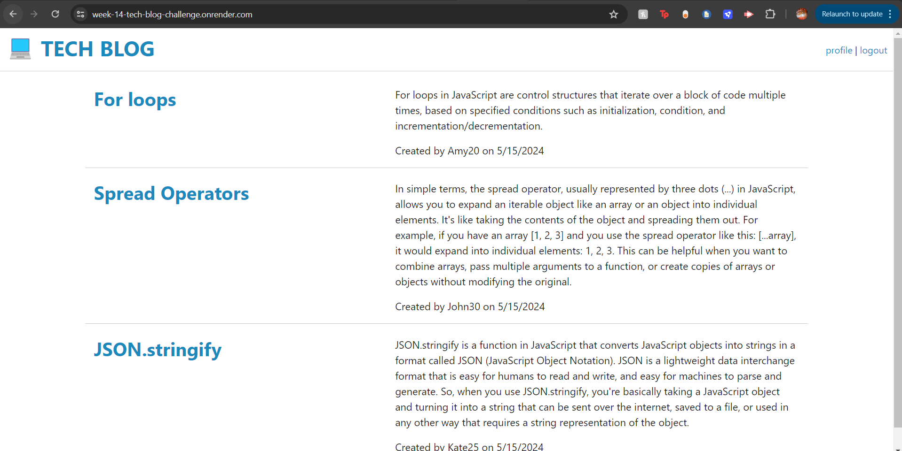

# Week-14-tech-blog-challenge

## Description

- I wanted to build a fullstack tech blog, that allows users to create an account, create update and delete posts, as well as comment on other users posts.

## Process
- The first thing i did was set up my mvc folder structure.
- Then i set up my env file and my schema db
- Next i created my post model, user model and comment model and defined their relationships in the index.js file.
- Then i created my seed data and in order to seed the models with data.
- Next i created my user routes which included:
    - post route to take user input (req.body) and create a user (sign up)
    - post route to take user input (req.body) and verify password (use instance method) and login (log in)
    - post route to take the session obj created for the user when they logged in (req.session) and destroy it (log out)
- Then i moved on to my post routes which included:
    - post route to create a new post
    - put route to update an existing post
    - delete route to delete an existing post
- And the comment routes which included: 
    - post route to create a comment
- Next was the home routes which included: 
    - get route to display all the posts from any/all users on the homepage + associated users
    - get route to display the role thats clicked on + associated users + associated comments
    - get route to populate the update form with the selected roles information
    - get route to display all of the posts of the logged in user on their profile page
    - get route that redirects you to the profile page once logged in
    - get route that redirects you to the profile page once signed up
- Then i imported these routes into the index.js files to use them.
- Then i tested my routes in postman and moved on to creating my handlebars using the data returned in postman. (when creating handlebars i added script tags at the end of them and created their respective javascript files to add functionality to the pages)
- completed my front end javascript logic for the profile page 
- completed my front end comment javascript logic for the role page

## Challenges:
- For a while when i tried to login/signup (even though the routes were working) the login/signup buttons would just redirect me to the login page.
- I realized it was because in my user login/signup routes when creating my session objects i didnt include the response ( res.status(200).json(userData)) in the session objects, they were outside of them. which is why the withauth middleware would prevent me from accessing the profile page when i tried to login/signup.
- Also on my first deployment i forgot to inclue 'node seeds/seeds.js' in render deployment instructions so i had to manually recreated the seed data in the website, by creating accounts, post and comments

## Application

- deployed application link:
[https://week-14-tech-blog-challenge.onrender.com/](https://tech-blog-site.onrender.com/)

- screenshot of deployed application:

